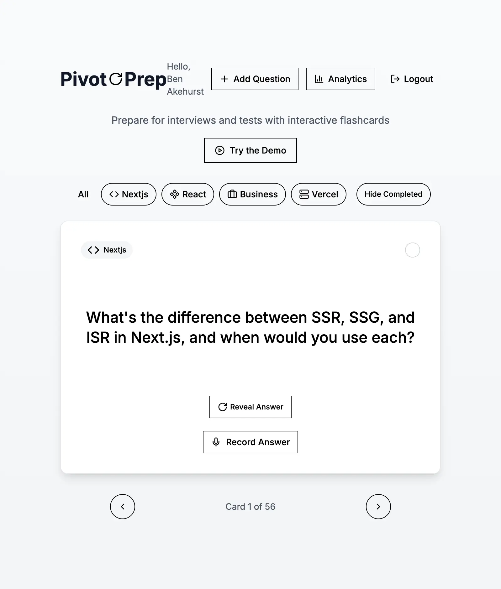

# PivotPrep

## What is PivotPrep?

PivotPrep is a web application designed to help users study and prepare using flashcards. It was created as part of my application process at Vercel and served as an opportunity to explore and upskill using Vercel's AI-powered "pair-programmer," V0.

[Try out a demo version here](https://v0-flashcard-study-app.vercel.app/demo)

## Features

- Create, edit, and manage flashcards
- AI-powered study assistance using OpenAI's API
- Responsive design for seamless use across devices
- Easy-to-use interface for efficient learning

## How did I create it?

Let me start from the beginning. In my day-to-day, I'm a Senior Software Engineer at [Rightmove](https://www.rightmove.co.uk). My most recent achievement there was leading and rolling out the replatforming of the main consumer search results page using Next.js. [You can see it in action here](https://www.rightmove.co.uk/property-for-sale/find.html?searchLocation=London&useLocationIdentifier=true&locationIdentifier=REGION%5E87490&radius=0.0&_includeSSTC=on).

I regularly use AI to aid in my development process, whether it be by reviewing my code for bugs, suggesting better ways of optimising code or writing unit tests, but for this project I wanted to go all in a try out [V0](https://v0.dev/), which is Vercel's "pair-programmer".

I feel I took more of a PM role, explaining to the AI what I wanted to achieve and via a back and forth with prompts and some genuinely mind-blowing outputs on V0s part, we started building and iterating features for PivotPrep.

I was able to use my full stack engineer experience and knowledge to fix small issues that arose, as well as debug issues when building to production, but for the most part I didn't really need to step in to write code myself!

The stack includes:

- **Frontend:** Next.js
- **Backend:** Node.js with MongoDB
- **AI Integration:** OpenAI API
- **Hosting:** Vercel

This approach allowed me to go from idea to production in just 10 minutes, showcasing the power of AI-assisted development.

### Running the application locally & prerequisites

- Nodejs v20+
- A MongoDB cloud database uri
- An OpenAI API key

#### Installing and running the application

1. Run `npm run setup-env`. This will create a `.env.local` file in the root of the project. You will need to add your MongoDB cloud database uri and OpenAI API key to this file.
2. Run `npm i` to install `node_modules`. You may have to run `npm i --force` if you run into issues with the installation
3. Run `npm run dev` in your terminal to get a local version of the app running
